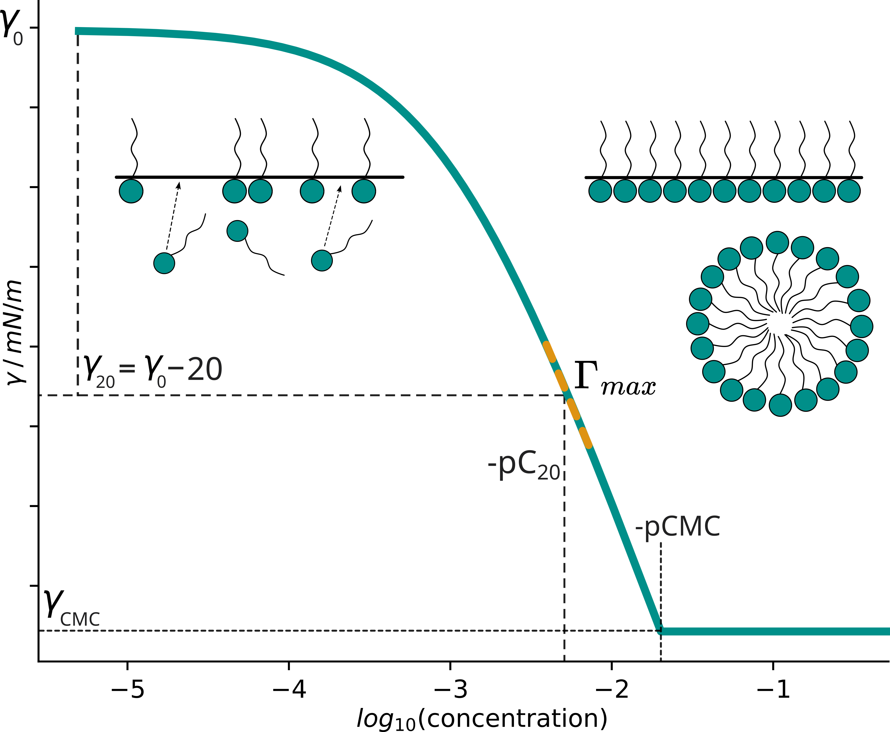

# SurfPro 
### A curated database and predictive model of experimental properties of surfactants
`SurfPro` is a *surf*actant *pro*perty database database of 1624 surfactants and their physical properties, including 1395 experimental measurements of the critical micelle concentration (CMC), 972 air-water surface tension at CMC ($\gamma_{\mathrm{CMC}}$) and further properties for over 650 surfactants curated from ~160 literature sources.

In addition to the database, this repository contains all code to reproduce the model training, evaluation and prediction pipeline for the AttentiveFP models and baselines used in the paper.

**Please cite our work if you wish to use any of the data sets**.

## SurfPro Database 
The SurfPro database is provided in four csv files. `surfpro_literature.csv` is the source file with all 1624 unique surfactant structures (SMILES), their curated experimental properties from literature, as well as the reference / DOI for each property / structure.
We split this database into a train and test set with stratification by surfactant type to obtain `surfpro_train.csv` and `surfpro_test.csv` (see Methods in the Paper or [scripts/test_split.py](scripts/test_split.py) for more details). 
`surfpro_test` contains a total of 140 surfactant structures, with 140 pCMC measurements, as well as all 6 properties for a subset of 70 structures.
`surfpro_train` contains all other 1484 structures and properties, but for many structures only a subset of their properties are available.
We used the trained models to impute these missing propreties for all 977 structures with incomplete properties, which we provide in the `surfpro_imputed.csv` file.
In this file, all missing property values are imputed with predictions and uncertainties from the multi-property ensemble.

```
data/surfpro_literature.csv         raw dataset with references (1624 structures, incomplete properties)
data/surfpro_train.csv              csv ready for training training & validation (1484 structures)
data/surfpro_test.csv               stratified test set for evaluation (140 structures)
data/surfpro_imputed.csv            imputed database (1624 structures with predictions for all missing properties) 
```

## Properties
We collected 6 properties of surfactants in the database, which are derived from the experimentally determined Langmuir isotherm (see Figure below).
647 structures have all 6 properties reported, while all other 977 structures have partially missing properties.

| Property                                  | Database Name    | Property Name                        | Unit               | Count |
|-------------------------------------------|------------------|--------------------------------------|--------------------|-------|
| CMC \| pCMC                               | CMC \| pCMC      | critical micelle concentration       | $\mathrm{M}$       | 1395  |
| $\gamma_{\mathrm{CMC}}$                   | AW\_ST\_CMC      | (air-water) surface tension at CMC   | $\mathrm{mN/m}$    | 972   |
| $\Gamma_{\mathrm{max}}$                   | Gamma\_max       | maximum surface excess concentration | $\mathrm{mol/m^2}$ | 672   |
| $\mathrm{C_{20}}$ \| $\mathrm{pC_{20}}$   | C20 \| pC20      | adsorption efficiency                | $\mathrm{M}$       | 657   |
| $\mathrm{A_{min}}$                        | Area\_CMC        | area at the air-water interface      | $\mathrm{nm^2}$    | 678   |
| $\pi_{\mathrm{CMC}}$                      | Pi\_CMC          | surface pressure at CMC              | $\mathrm{mN/m}$    | 744   |

pCMC refers to the negative log10 of the CMC in Molar ([mol/L]): 
$\mathrm{pCMC} = -\log(\mathrm{CMC})$.

Similarly, C20 refers to the inverse of pC20: 
$\mathrm{C_{20}} = 10^{-\mathrm{pC_{20}}}$.


## The Langmuir isotherm


Schematic visualization of the Langmuir isotherm using the Szyszkowski equation and derived properties. 
Surfactant molecules adsorb to the air-water interface and lower the surface tension. 
With increasing surfactant concentration (x-axis, log scale) the surface tension $\gamma$ (y-axis) decreases until the interface is saturated and $\gamma$ stops decreasing further. 
Beyond this critical point, surfactants self-assemble into micelles.
Surfactant properties can be extracted from this experimentally determined isotherm: the critical micelle concentration (CMC) and the surface tension at the CMC ($\gamma_{\mathrm{CMC}}$).
$\mathrm{C_{20}}$ is defined as the surfactant concentration required to reduce the surface tension $\gamma_0$ (72mN/m for water at room temperature) by 20 mN/m, which quantifies the surfactant's efficiency.
$\Gamma_{\mathrm{max}}$ characterizes the slope at the steepest descent of the isoterm (shown in orange), which is assumed to be at $\gamma_{20}$.
The area of the surfactant at the air-water interface $\mathrm{A_{min}}$ and the surface pressure at CMC $\pi_{\mathrm{CMC}}$ can also be determined from the isotherm (not visualized).

## Dataloader
We provide a dataloader in [src/dataloader.py](src/dataloader.py), which transforms [surfpro_train.csv](surfpro_train.csv) and [surfpro_test.csv](surfpro_test.csv) into ready-to-use featurized data splits, using the same 10 train/validation folds with featurization for GNNs, ECFP and RDKit (defined in [src.dataloader.SurfProDB](src.dataloader.SurfProDB) and [src.dataloader.DataSplit](src.dataloader.DataSplit)). 
The graph neural network (AttentiveFP) training script ([scripts/train_model.py](scripts/train_model.py)) uses this dataloader as part of the DVC pipeline.
The [scripts/make_baselines.py](scripts/make_baselines.py) script uses the dataloader directly as input features for established ML models (RandomForest and Ridge) using ECFP or RDKit fingerprints.

## Featurizers
We used an established featurization approach to obtain molecular representations suitable as input for any graph neural network in [src/featurizer.py](src/featurizer.py).
We extended the graph input featurization from AttentiveFP implementation [[Github](https://github.com/OpenDrugAI/AttentiveFP/blob/master/code/AttentiveFP/)] to interface with `pytorch-geometric.Data` and `pytorch-geometric.nn.models.AttentiveFP` [docs](https://pytorch-geometric.readthedocs.io/en/latest/generated/torch_geometric.nn.models.AttentiveFP.html).
We used the RDKit 200-bit fingerprint (`'featurize = rdkit'`), as well as Morgan fingerprints `'featurize = ecfp'` for our baselines.
[src/dataloader/SurfProDB](src/dataloader/SurfProDB) accepts the argument `'featurize = ..'` to load and featurize them.


## Tasks
We explored the following **tasks**.
The [SurfProDB](src/dataloader/SurfProDB) accepts the argument `'task = ..'`.
- single-property pCMC [[task='cmc']](conf/task/cmc.yaml)
- single-property AW_ST_CMC [[task='awst']](conf/task/awst.yaml)
- single-property Gamma_max [[task='gamma']](conf/task/gamma.yaml)
- single-property pC20 [[task='pc20']](conf/task/pc20.yaml)
- multi-property [[task='multi']](conf/task/multi.yaml)
- all-property [[task='all']](conf/task/all.yaml)


## Configuration: DVC + Hydra
This project's pipeline leverages DVC and Hydra to configure the [params.yaml](params.yaml) file on-the-fly for experiments.

For `task`, `model` and `host` 
Trains and evaluates the AttentiveFP model [conf/model/attfp-32d.yaml](conf/model/attfp-32d.yaml) / [conf/model/attfp-64d.yaml](conf/model/attfp-64d.yaml) / [conf/model/attfp-96d.yaml](conf/model/attfp-96d.yaml).

The full pipeline being executed is defined in [dvc.yaml](dvc.yaml), and copies the final outputs from ./out/{...} (or the temp run directory when using --queue) into /pathto/SurfPro/results/{task}/{model}/...
For this, the absolute path is necessary, which is defined in [params.yaml](params.yaml) as host.masterdir, in contrast to the host.workdir used within an experiment. You will need to change this config file to successfully run the full 'dvc queue' pipeline.

An individual model run (model variant * task) can be executed via dvc with task={...} and model={...} overrides of config files found in /conf/task/* and /conf/model/*.
You can additionally override individual configurations: '-S 'host.device=[1]'. For `dvc queue`, the setup requires the workdir to be '.' since dvc executes the run in a temporary directory.


# Reproducing results of the paper 
### Conda setup 
```
git clone https://github.com/BigChemistry-RobotLab/SurfPro.git
cd SurfPro
conda create -n surfpro
conda activate surfpro
conda install pip
pip install -r requirements.txt

dvc config hydra.enabled=True

dvc exp run -S 'task=multi' -S 'model=attfp-64d' -S 'host=local' -S 'host.masterdir="/path/to/your/SurfPro"'
```


### reproduce all AttentiveFP model experiments
```
dvc exp run --queue -S 'task=all,multi,cmc,awst,gamma,pc20' -S 'model=attfp-32d,attfp-64d,attfp-96d' -S 'host=queue'

# or directly override: [...] -S host.masterdir="/path/to/your/SurfPro"'
```

### reproduce all baselines experiments (RDKit | ECFP x Ridge | RF for 4 single-property tasks)
```
python scripts/make_baselines.py
```

### run a single AttentiveFP experiment, overriding specific configuration
```
dvc exp run -S 'task=cmc' -S 'model=attfp-32d' -S 'model.n_epochs=100' -S 'task.n_splits=2'
```

### run multiple experiments using dvc queue
```
dvc queue status
dvc queue logs NAME --follow
dvc queue remove --all

dvc exp run --queue -S 'host.workdir="."' -S 'host.device=[1]' -S 'task=all,multi,cmc,awst,gamma,pc20' -S 'task.n_splits=10' -S 'model.n_epochs=500' -S 'model.hidden_channels=64' -S 'model.out_channels=128'

dvc exp run --queue -S 'task=cmc' -S 'model=attfp-64d' -S 'model.n_epochs=1000' -S 'model.dropout=0.0,0.1,0.2' -S 'model.num_timesteps=2' -S 'model.num_layers=2,3,4' -S 'task.n_splits=10' -S 'host.device=[0]'
```

### process train/test.csv into featurized DataSplits using params.yaml & conf/task/*
```
python src/dataloader.py
# writes surfpro.pickle file to 
# {cfg.host.workdir}/data/{cfg.task.name}/surfpro.pkl
```


## DVC credentials and wandb 
DVC requires git credentials to create local commits tracking experiments. 
You can use arbitrary credentials if you do not want to provide yours.
```
git config user.name "Your Name"
git config user.email "you@example.com"
```
Similarly, this codebase leverages `wandb` to track experiments.
You can set it to run offline / disabled if you do not want to use wandb,
or replace the `wandblogger` with another logger used by the pl.Trainer in train_model.py.
```
wandb offline
# or
wandb disabled
```

